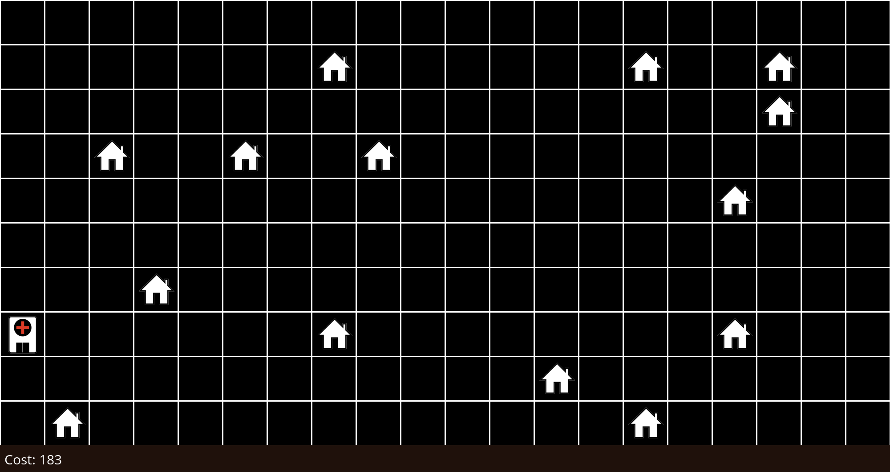
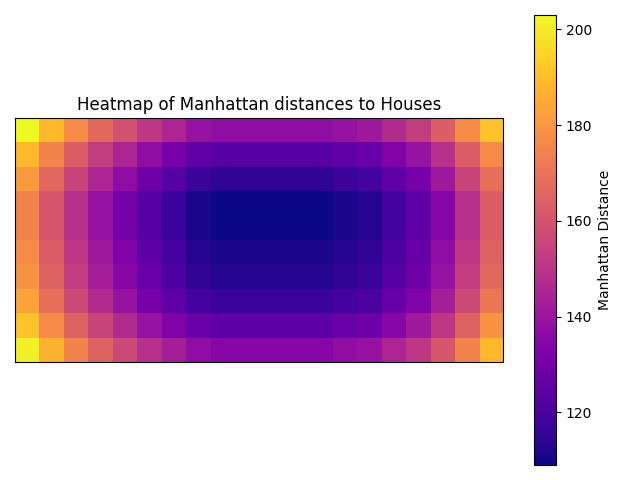
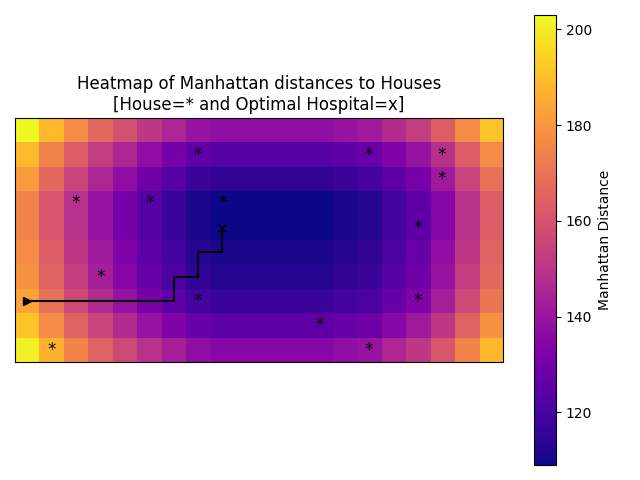

# Visualization of Cost Function State-Space Landscape

## Project Overview

This project visualizes the state-space landscape of a cost function in the context of optimizing the placement of a hospital. The visualization includes:

1. **Initial Grid Map**: Displaying the locations of houses and the initial hospital placement.
2. **Heatmap Visualization**: A 2D heatmap representing the Manhattan distances from every grid cell to all houses.
3. **Optimization Process**: Visualization of the optimization process (hill climbing) to find the optimal hospital location, minimizing the cost (sum of Manhattan distances to houses).

### Expected Outputs
- **Grid Map**: Initial map with houses placement.
- **Heatmap**: A visual representation of the Manhattan distances and locations of houses and hospital.
- **Optimization Path**: The path taken by the hospital placement during the hill-climbing optimization process.

## Instructions to Run the Code

### Prerequisites
Install required packages:
   ```bash
   pip install numpy matplotlib pillow
   ```
---
### Running the Code
Run the script:
   ```bash
   py hospitals.py
   ```
Output images and visualizations will be saved in timestamped folder.

---
## Results

### 1. Initial Grid Map
Below is an example of the initial grid map with houses (shown as icons) and the initial hospital placement:



### 2. Heatmap
A heatmap of Manhattan distances, where lighter areas represent lower distances:



### 3. Optimization Path
The optimization process visualized over the heatmap:



---
## Customization
1. Adjust the grid dimensions (`height` and `width`) and number of houses in the `Space` initialization.
2. Change the colormap and marker styles for the heatmap by editing the `plot_heatmap` function.
3. When testing with more than 1 hospital, use `random_restart` function to find global maxima/minima solutions.